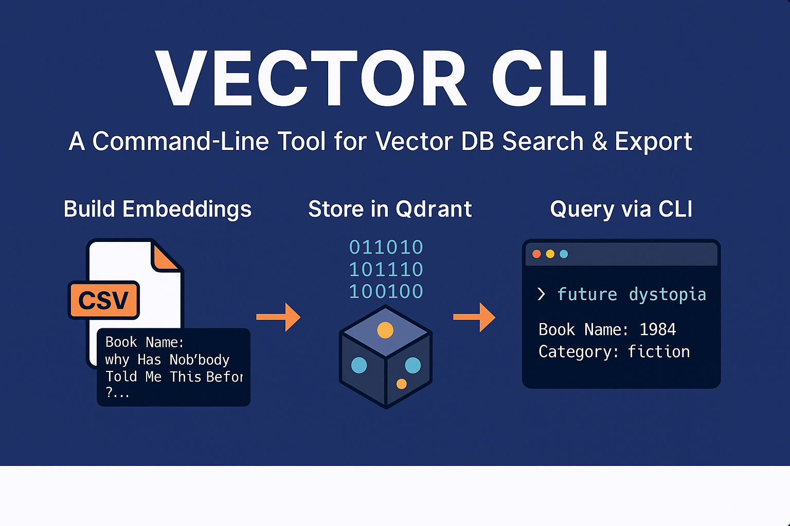

 
# 📚 Vector CLI - Search, Manage, and Export Your Text Embeddings

**Vector CLI** is a Python-based command-line tool to manage datasets with text embeddings, store them into a vector database (Qdrant), search over them, and export results.

This project is **dynamic**, **dataset-agnostic**, and designed for **production-ready** embedding pipelines.

---

## ❓ What is a Vector Database?

A **Vector Database** is a type of database optimized to store and search high-dimensional vectors, such as those generated by machine learning models (embeddings).

Traditional databases are good at matching exact values, but not at finding "similar" items based on meaning or context.

Vector databases allow you to:

* Store text, image, or audio embeddings
* Perform similarity search (e.g., "find texts most similar to this one")
* Power features like semantic search, recommendation engines, and clustering

[Learn more about Vector Databases](https://www.pinecone.io/learn/vector-database/)

---

## 💡 Why Use a CLI for Vector DB Tasks?

Writing CLI commands for your vector workflows allows you to:

* **Automate** and script processes (ideal for production pipelines)
* **Reuse** commands easily across multiple datasets
* **Control** and debug each step (embedding, upload, search, export)
* Keep your **workflow transparent** and **reproducible**

This is especially useful for research workflows, data labeling, or setting up ML search systems.

---

## 🚀 Features

* Process any CSV dataset with customizable columns (text, title, category).
* Generate embeddings using a free open-source model (`all-MiniLM-L6-v2`).
* Store embeddings into a local Qdrant instance (runs via Docker).
* Search by text queries with optional duplicate filtering.
* Export full collections or specific search results into CSV or JSON files.
* Clear (delete) collections easily.
* Fully dynamic column mapping — works with any dataset without code changes.
* CLI-first design, perfect for integration into larger systems.

---

## 🔗 Open Source Libraries Used

This project is built on powerful open-source components:

* [**Qdrant**](https://qdrant.tech/) — An open-source vector database designed for fast, scalable similarity search
* [**Sentence Transformers**](https://www.sbert.net/) — A Python library that provides easy-to-use models for computing sentence and text embeddings
* [**all-MiniLM-L6-v2**](https://huggingface.co/sentence-transformers/all-MiniLM-L6-v2) — A fast and lightweight model for generating semantic embeddings (110MB)
* [**Typer**](https://typer.tiangolo.com/) — Modern library for building CLI applications with Python

---

## 🛠️ Installation

### 1. Clone the repository

```bash
git clone https://github.com/your_username/vector-cli.git
cd vector-cli
```

### 2. Install dependencies

```bash
python3 -m venv .venv
source .venv/bin/activate
pip install -r requirements.txt
```

### 3. Run Qdrant with Docker

```bash
docker run -p 6333:6333 -p 6334:6334 qdrant/qdrant
```

---

## ⚙️ Available CLI Commands

> All commands assume you're inside the `vector-cli/` directory.

### Create Embeddings (`agent`)

```bash
python3 vector_cli/cli.py agent path/to/your_dataset.csv --text-column Summary --title-column Book_Name --category-column Categories
```

### Upload Embeddings to Qdrant (`upload`)

```bash
python3 vector_cli/cli.py upload outputs/vector_data.pkl book_summaries
```

### Inspect Collection (`inspect`)

```bash
python3 vector_cli/cli.py inspect book_summaries --limit 5
```

### Search Collection (`search`)

```bash
python3 vector_cli/cli.py search "future dystopia" book_summaries --limit 10 --unique
```

- `--unique`: Optional. Return only one result per unique title.

### Export Full Collection (`export`)

```bash
python3 vector_cli/cli.py export book_summaries --format csv --limit 100
```

### Export Search Results (`search-export`)

```bash
python3 vector_cli/cli.py search-export "mental health" book_summaries --limit 10 --unique --format json
```

### Clear Collection (`clear`)

```bash
python3 vector_cli/cli.py clear book_summaries
```

---

## 📦 Project Structure

```plaintext
vector-cli/
├── vector_cli/
│   ├── agent.py        # Process CSV datasets and generate embeddings
│   ├── vectordb.py      # Manage interaction with Qdrant (upload, search, export)
│   ├── cli.py           # Command Line Interface using Typer
│
├── outputs/             # Generated embeddings (.pkl)
├── exported_data/       # Full collection exports
├── exported_search/     # Search result exports
└── README.md
```

---

## 🧐 Tech Stack

- **Python 3.9+**
- **Typer** – Modern CLI framework
- **Sentence Transformers** – Open-source text embeddings
- **Qdrant** – Vector database (runs locally via Docker)

---

## 🚀 Future Plans

- Tauri + TypeScript Web Inspector (Web-based search & visualization).
- Improved export options (custom filters, advanced queries).
- Support for multi-label categories.
- Authentication for production deployments.

---

## 💬 Contact

For feedback, collaboration, or ideas:  
**[LinkedIN](https://www.linkedin.com/in/furkancankaya/)** 
**[GitHub](https://github.com/cankaya96)**

